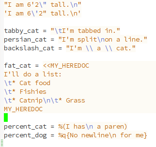

Highlight Escape Sequences
----



Look inside for instructions.

The theme on the screenshot is
[espresso](https://github.com/dgutov/espresso-theme), with the
following addition:

```
(put 'hes-escape-backslash-face 'face-alias 'font-lock-builtin-face)
(put 'hes-escape-sequence-face 'face-alias 'font-lock-builtin-face)
```
